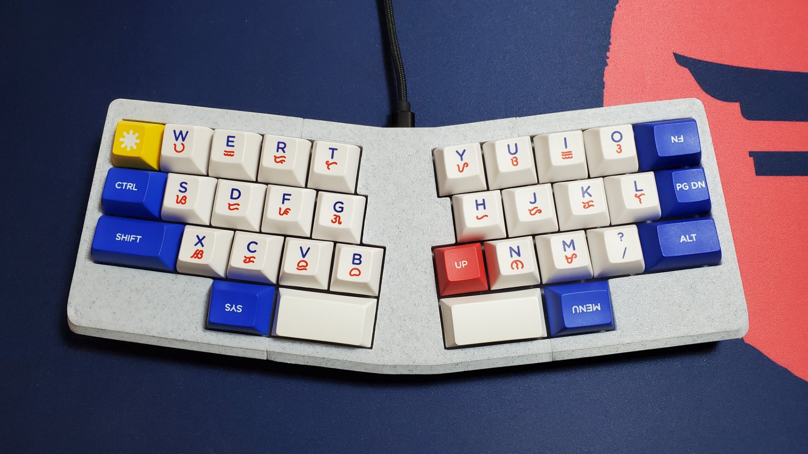
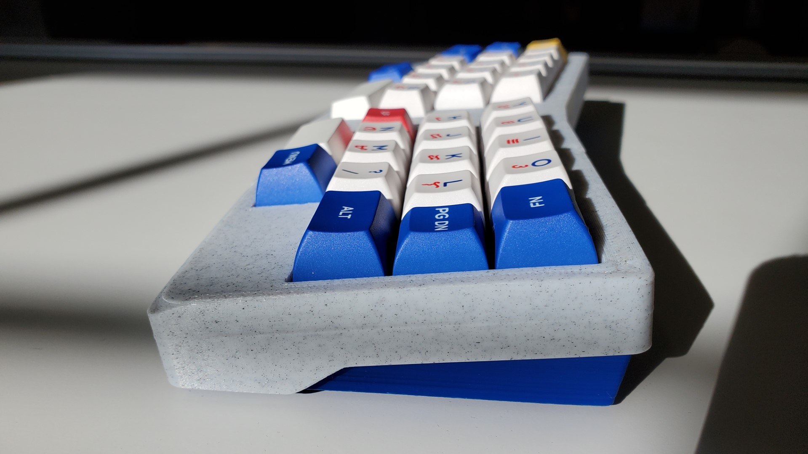
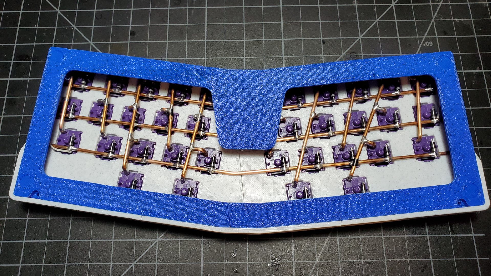

# La Lettre

unironically "the letter" in French

Another unibody split 35% 3d printed handwired mechanical keyboard. A row staggered take on the [Le Chiffre](https://github.com/tominabox1/Le-Chiffre-Keyboard) layout plus [QAZ](https://www.cbkbd.com/product/qaz-keyboard-kit) "modifiers", with design inspiration from [C13-X](https://github.com/flurples/C-13X) and [Adalyn](https://github.com/MarvFPV/Adalyn).

## Project Structure

The `split` and `nonsplit` folders have STLs for printing and STEPs for modification. Note the `nonsplit` case is untested. The Fusion 360 timeline is also included, and component color cycling can be toggled (Shift+N).

## Components

| Part                        | Quantity                  |
| --------------------------- | ------------------------- |
| Keycaps                     |                           |
| Switches                    | 34                        |
| Diodes (1N4148/1N4001)      | 34                        |
| Conductive Rods/Hookup Wire |                           |
| M2 Screws                   | 8 (4 if friction fitting) |
| M2 Heat Set Inserts         | 8 (4 if friction fitting) |
| 8mm Rubber Bumpons          | 4                         |
| USB-C Pro Micro Clone       | 1                         |

## Assembly Notes

The case has a 5mm top mounted plate, designed around [M2x4x3.5mm heat set inserts](https://www.amazon.com/Mardatt-M2x4x3-5-Threaded-Printing-Embedment/dp/B08ZH89PK4). If you want the plate to flex from the mounting, I suggest using regular wire instead of rigid brass rods. The case bottom is supposed to screw into the top, but friction fitting the two pieces together also works.

The USB cutout on the bottom is designed around the longer [USB-C Pro Micro](https://www.amazon.comAITRIP-ATmega32U4-Development-Compatible-ATmega328/dp/B09J4S9XS2), so traditional micro USB Pro Micros and midmount Elite-Cs won't work without modifying the bottom.

If printing the `split` case, each divided piece is held together with super glue.

## Firmware & Wiring

QMK Firmware files are included as a starting point, but compile and flash the firmware based on your matrix and keymap preferences.

### Wiring/Matrix Diagram

## Additional Images

